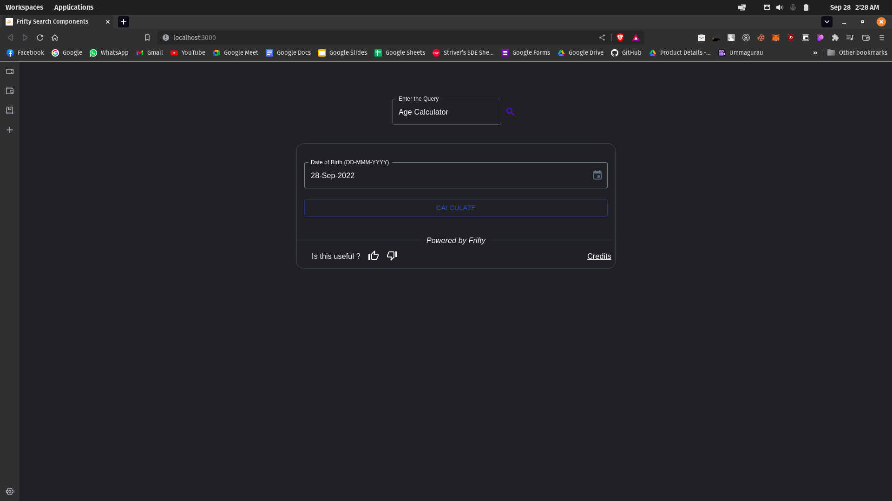

# Getting Started

## Step 1: Clone the GitHub Repository

Clone the following GitHub Repository

```bash
git clone https://github.com/frifty-search/search-apps.git
```

## Step 2: Install Dependencies

Go to the Folder and install the dependencies via npm&#x20;

```bash
cd search-apps && npm install
```

if you are using the yarn package manager, use this command.

```bash
cd search-apps && yarn install
```

## Step 3: Install Template Dependencies

Install the template dependencies using npm

```bash
npm run usecase:install
```

if you are using the yarn package manager, use this command.

```bash
yarn usecase:install
```

## Step 4: Build Template Dependencies

Build the template Dependencies using npmnpm run usecase:build

```bash
npm run usecase:build
```

if you are using the yarn package manager, use this command.

```bash
yarn usecase:build
```

# Creating a Use Case

To create a new use case, use the below command&#x20;

```bash
npm run usecase:create
```

if you are using yarn package manager

```bash
yarn usecase:create
```

It gives you a prompt to name the use-case,

<figure><figcaption></figcaption></figure>

> Note: If the use-case name contains two words, then separate it with \_ or \<space>

# Testing Locally

Use `npm run dev` or `yarn dev` command to run the project locally.&#x20;

```bash
npm run dev or yarn dev
```

it automatically opens your default browser.

<figure><figcaption></figcaption></figure>

As for now, we have not implemented the testing procedure. So you guys have to manual test it using the search querys.

## Contributing to Frifty Apps

Thank you for your interest in contributing to Frifty. Regardless of the size of the contribution you make, all contributions are welcome and are appreciated.

If you are new to contributing to open source, please read the Open Source Guides on [How to Contribute to Open Source](https://opensource.guide/how-to-contribute/).

### Ways to Contribute

If you are ready to start contributing code right away, we have a list of [good first issues](https://github.com/frifty-search/search-apps/issues/labels/good%20first%20issue) that contain issues with a limited scope.

### Contributing Code

Code contributions to Frifty come in the form of pull requests. These are done by forking the repo and making changes locally.

The process of proposing a change to Frifty can be summarized as:

1. Fork the Frifty repository and branch off `main`.
1. The repository can be cloned locally using `git clone <forked repo url>`.
1. Make the desired changes to the source.
1. Run the app and test your changes.

### General Guidelines

#### Project structure

```
.
└── src/
    ├── components/
    │   ├── main/
    │   │   └── main.components.tsx
    │   ├── searchBox/
    │   │   └── search.components.tsx
    │   └── utils/
    │       └── renderApp.utils.tsx
    ├── usecase/
    │   ├── dumbCharades/
    │   │   └── index.tsx
    │   └── index.tsx
    ├── utils/
    │   ├── api.utils.tsx
    │   ├── appName.utils.tsx
    │   └── theme.utils.tsx
    ├── App.tsx
    └── index.tsx
```

#### Commit guidelines

```
feat: (addition of a new feature)
rfac: (refactoring the code: optimization/ different logic of existing code - output doesn't change, just the way of execution changes)
docs: (documenting the code, be it readme, or extra comments)
bfix: (bug fixing)
chor: (chore - beautifying code, indents, spaces, camelcasing, changing variable names to have an appropriate meaning)
ptch: (patches - small changes in code, mainly UI, for example color of a button, increasing size of text, etc)
conf: (configurational settings - changing directory structure, updating gitignore, add libraries, changing manifest etc)
```
